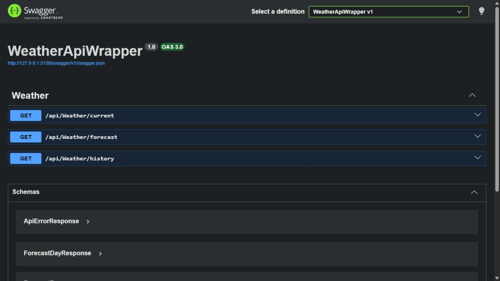
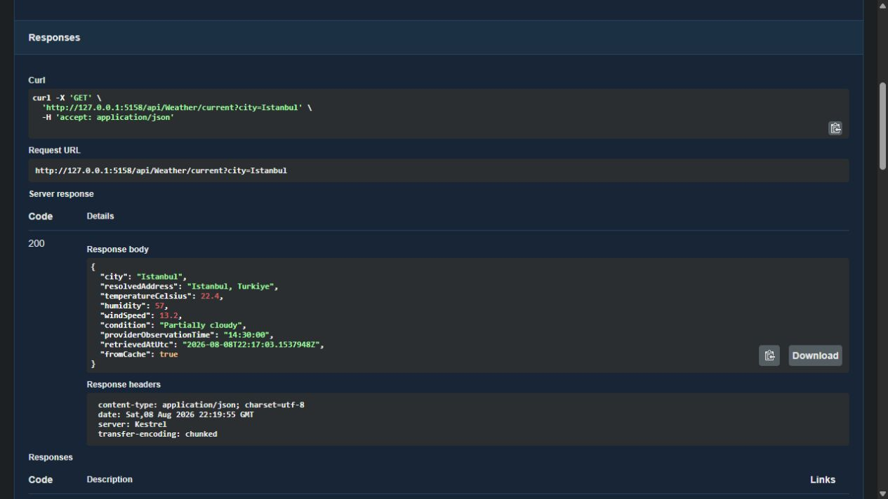
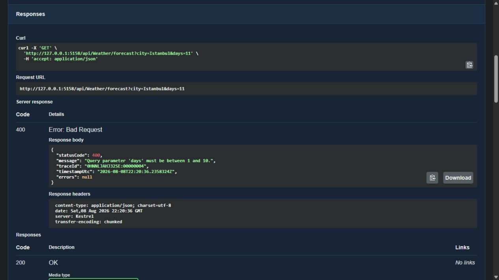

# Weather API Wrapper

[](https://github.com/batuhansacofficial/WeatherApiWrapper/actions/workflows/ci.yml)
[](https://dotnet.microsoft.com/download/dotnet/10.0)
[](LICENSE.txt)

A resilient ASP.NET Core Web API that aggregates weather data from an external provider and exposes normalized current, forecast, and historical weather endpoints.

## Features

- Current weather endpoint
- Forecast weather endpoint
- Historical weather endpoint
- Redis distributed caching
- Cache-aside pattern
- Centralized exception handling middleware
- Standardized API error responses
- Fail-fast provider configuration validation
- Explicit caller-cancellation and upstream-failure semantics
- HTTP resilience with retry, timeout, and circuit breaker
- Request logging
- Swagger / OpenAPI support
- Unit tests
- Integration tests

## Tech Stack

- ASP.NET Core 10 Web API
- .NET 10
- Redis 8.8
- HttpClient
- xUnit
- Moq
- Docker
- Swagger / OpenAPI
- GitHub Actions

## API Preview

The screenshots use deterministic local provider data and an isolated Redis instance. No provider credentials are included.

### Swagger Endpoint Overview



### Cached Current-Weather Response



### Standardized Validation Error



## Project Structure

```text
WeatherApiWrapper/
 ├─ Controllers/
 ├─ Exceptions/
 ├─ Extensions/
 ├─ Middleware/
 ├─ Models/
 ├─ Options/
 ├─ Services/
 ├─ Program.cs
 ├─ appsettings.json
 └─ WeatherApiWrapper.csproj

WeatherApiWrapper.Tests/
 ├─ Controllers/
 ├─ Middleware/
 ├─ Services/
 ├─ TestDoubles/
 ├─ CustomWebApplicationFactory.cs
 ├─ ResiliencePipelineTests.cs
 └─ WeatherApiIntegrationTests.cs

docs/images/
 ├─ swagger-overview.png
 ├─ swagger-current-cache-hit.png
 └─ swagger-validation-error.png
```

## Endpoints

**Note**: The example responses below are sample outputs captured during local testing.

### 1. Current Weather

```http
GET /api/weather/current?city=Istanbul
```

Example response:

```json
{
  "city": "Istanbul",
  "resolvedAddress": "Istanbul",
  "temperatureCelsius": 13.8,
  "humidity": 38.9,
  "windSpeed": 12.6,
  "condition": "Partially cloudy",
  "providerObservationTime": "16:50:00",
  "retrievedAtUtc": "2026-04-12T14:20:11.6427296Z",
  "fromCache": false
}
```

---

### 2. Forecast Weather

```http
GET /api/weather/forecast?city=Istanbul&days=3
```

Example response:

```json
{
  "city": "Istanbul",
  "resolvedAddress": "Istanbul",
  "daysRequested": 3,
  "retrievedAtUtc": "2026-04-12T14:31:22.7307341Z",
  "fromCache": false,
  "forecasts": [
    {
      "date": "2026-04-12",
      "temperatureMaxCelsius": 13.8,
      "temperatureMinCelsius": 6.4,
      "humidity": 56.3,
      "windSpeed": 16.2,
      "condition": "Partially cloudy"
    },
    {
      "date": "2026-04-13",
      "temperatureMaxCelsius": 13.3,
      "temperatureMinCelsius": 8.3,
      "humidity": 64.3,
      "windSpeed": 17.6,
      "condition": "Partially cloudy"
    }
  ]
}
```

---

### 3. Historical Weather

```http
GET /api/weather/history?city=Istanbul&date=2026-04-01
```

Example response:

```json
{
  "city": "Istanbul",
  "resolvedAddress": "Istanbul",
  "requestedDate": "2026-04-01",
  "retrievedAtUtc": "2026-04-12T20:44:17.8124659Z",
  "fromCache": false,
  "history": {
    "date": "2026-04-01",
    "temperatureMaxCelsius": 19.1,
    "temperatureMinCelsius": 9.8,
    "temperatureAverageCelsius": 13.6,
    "humidity": 71.3,
    "windSpeed": 37.3,
    "condition": "Rain, Partially cloudy"
  }
}
```

## Validation Rules

### Current

* `city` is required

### Forecast

* `city` is required
* `days` must be between `1` and `10`

### History

* `city` is required
* `date` is required
* `date` must be in `yyyy-MM-dd` format
* `date` cannot be in the future

## Error Response Format

All API errors are returned in a standardized structure:

```json
{
  "statusCode": 400,
  "message": "Validation failed.",
  "traceId": "00-abc123",
  "timestampUtc": "2026-04-15T15:02:16.4849891Z",
  "errors": {
    "date": [
      "The value 'abc' is not valid."
    ]
  }
}
```

## Caching

This project uses Redis distributed cache.

Cache strategy:

* Current weather: short expiration
* Forecast: medium expiration
* Historical weather: longer expiration

The API uses the cache-aside pattern:

1. Check cache
2. If cache miss, call external provider
3. Save response to cache
4. Return cached result on subsequent requests

## Resilience

Outgoing HTTP requests are protected with:

* Retry (with jitter)
* Timeout (per attempt + total)
* Circuit breaker

This improves API reliability when the external weather provider is slow or temporarily unavailable.

## Setup

### 1. Clone the repository

```bash
git clone https://github.com/batuhansacofficial/WeatherApiWrapper.git
cd WeatherApiWrapper
```

### 2. Set the API key

Use .NET User Secrets:

```bash
dotnet user-secrets init
dotnet user-secrets set "WeatherApi:ApiKey" "YOUR_API_KEY"
```

### 3. Run Redis with Docker

```bash
docker run -d --name weather-redis -p 6379:6379 redis:8.8.1-alpine
```

### 4. Configure `appsettings.json`

```json
{
  "WeatherApi": {
    "BaseUrl": "https://weather.visualcrossing.com/VisualCrossingWebServices/rest/services/timeline/"
  },
  "ConnectionStrings": {
    "Redis": "localhost:6379"
  }
}
```

### 5. Run the API

```bash
dotnet run --project WeatherApiWrapper
```

### 6. Open Swagger

```
https://localhost:7081/swagger
```

or

```
http://localhost:5158/swagger
```

## Running Tests

This project includes both unit tests and integration tests.

Run all tests with:

```bash
dotnet test WeatherApiWrapper.slnx --configuration Release
```

## Test Coverage

The current verified suite contains 57 tests and measures 95.6% line coverage and 75.4% branch coverage. The suite covers:

- Current, forecast, and historical mapping and caching behavior
- Redis graceful fallback and request-cancellation propagation
- Provider HTTP, malformed-payload, timeout, and open-circuit classification
- Controller validation and ASP.NET model-binding errors
- Standardized 400, 404, 500, 502, and 504 API contracts
- Startup validation for required provider configuration
- The dependency-injection configured resilience pipeline

Generate a local Cobertura report with:

```bash
dotnet test WeatherApiWrapper.slnx --configuration Release --collect:"XPlat Code Coverage" --results-directory TestResults
```

CI uploads the test results and coverage report as a downloadable workflow artifact. No arbitrary coverage threshold is enforced.

## Continuous Integration

Every push and pull request to `master` verifies:

- NuGet restore with transitive vulnerability auditing
- Formatting
- Release build with warnings treated as errors
- Tests with Cobertura coverage collection
- The Docker Compose build on Linux

## Running with Docker

Run the API and Redis together using Docker Compose.

### 1. Create a `.env` file

```env
WEATHER_API_KEY=YOUR_API_KEY
```

### 2. Start the application

```bash
docker compose up --build
```

### 3. Open Swagger

```
http://localhost:8080/swagger
```

### 4. Stop containers

```bash
docker compose down
```

## Highlights

* Built a resilient ASP.NET Core Web API
* Integrated an external weather provider
* Implemented Redis distributed caching
* Added centralized exception handling
* Standardized API error responses
* Added unit and integration tests
* Added resilience policies for outbound HTTP requests

## Public Deployment Note

This repository is configured for local development and portfolio demonstration. Authentication and rate limiting are intentionally not included. Add appropriate access control, request limits, secret management, and Redis network restrictions before exposing an instance that uses a real provider key to the public internet.

## License

This project is licensed under the MIT License. See [LICENSE.txt](LICENSE.txt) for details.

This project was built for learning and portfolio purposes.
